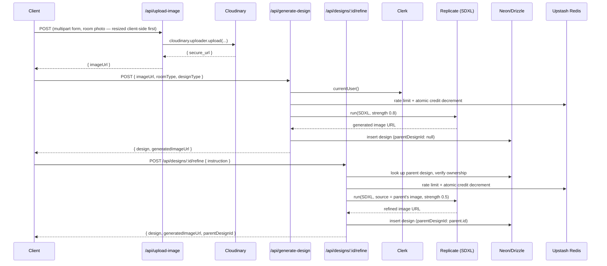

# AI Room Design

## What this is

Upload a photo of your room, pick a style, and get back a redesigned version — then keep iterating on it. Say "change the sofa to a beige sectional" or "make the walls warmer" against a design you already have, and get a new version linked back to the one before it, without losing the room you started with. That refinement loop — not the one-shot generation — is the actual point of this project: most AI redesign tools give you a single result and stop; this one treats a design as something you converge on, not something you get right in one try.

There is also a separate text-to-image path (Ideogram via Replicate) for generating a room concept from a written description alone, with no starting photo — a different intent from redesigning a real room, so it stays a separate flow rather than being forced into the same one.

The stack is Next.js 15 App Router, React 19, Neon serverless Postgres with Drizzle ORM, Clerk for auth, Cloudinary for image storage, Upstash Redis for credits/rate-limiting, and Replicate as the inference host for both AI models.

---

## Key feature: iterative design refinement

`POST /api/designs/:id/refine` takes a short instruction ("change the sofa") against an existing design and produces a new one, linked to it via a self-referencing `parentDesignId` column on `designs`. A design's history is just an ordered chain — original → v1 → v2 — not a tree editor; the dashboard renders each chain as a simple vertical sequence, comparing each version to the one right before it.

A refinement always regenerates from the **previous generation's image**, not the original photo, so "change the sofa" doesn't also silently undo an earlier "warmer walls" change. The prompt sent to SDXL is built explicitly around three things: the established style, the one requested change, and an explicit list of what to preserve (architecture, walls, windows, doors, camera perspective, existing furniture and colors except what was asked to change).

Initial generation and refinement use different SDXL parameters, on purpose:

| | `strength` | `guidance_scale` | why |
|---|---|---|---|
| Initial generation | 0.8 | 7.5 | needs room to transform a real photo into a styled room |
| Refinement | 0.5 | 8.5 | should change less of an already-styled image; lower strength needs higher guidance so the one requested change still comes through instead of being smoothed away |

**Honest caveat:** SDXL image-to-image has no masking or inpainting — there is no way to say "only touch this region." Lower strength biases the model toward smaller, more targeted changes, but it cannot *guarantee* that only the requested object changes. Product copy says "Refine this design," never "guaranteed to change only one thing." The natural next step, if this turns out to matter in practice, is segmentation/masking so a refinement can be scoped to an actual region instead of the whole frame — worth building once there's evidence of where prompt-only refinement actually fails, not before.

---

## Architecture



If either Replicate call fails or returns nothing, the route calls `refundCredit()` (an atomic Redis `INCR`) before responding — a failed generation never costs the user a credit. Both routes validate the request body **before** touching credits at all, so a 400/401/402/429 never does either.

### Schema and data relationships

**`users`** — `id` (serial PK), `name`, `email` (`.unique()`), `imageUrl`, `credits` (`.default(3)`), `clerkId` (`.unique()`).

**`designs`** — `id` (serial PK), `userId` (Clerk ID, FK → `users.clerkId`, `ON DELETE CASCADE`), `originalImageUrl`, `generatedImageUrl`, `roomType`, `designType`, `additionalRequirements`, `createdAt`, `parentDesignId` (nullable, self-referencing FK → `designs.id`, `ON DELETE SET NULL`, indexed).

`originalImageUrl` is carried forward unchanged through an entire refinement chain, so a v3 design can still be compared back to the actual starting photo, not just its immediate parent.

### Auth flow

`middleware.js` protects `/dashboard(.*)` via Clerk's `clerkMiddleware`. Every API route that touches user data calls `currentUser()` first and 401s on null. User provisioning is idempotent and race-safe: both the Clerk webhook (`user.created`) and a client-triggered fallback call the same `upsertUserFromClerk()`, which uses `INSERT ... ON CONFLICT DO NOTHING` — whichever caller wins the race gets the inserted row back, the other falls through to a `SELECT` for the same row. Neither path throws.

### Credits and rate limiting

Both generation routes and the refine route share one Redis-backed gate: a sliding-window rate limiter (10 req/min per user via `@upstash/ratelimit`) and an atomic Lua check-and-decrement for credits (`credits:{userId}` in Redis). Postgres `users.credits` is a display-only mirror, updated best-effort after a successful generation — Redis is the source of truth enforcement runs against.

---

## Honest limitations

- **Refinement can't guarantee single-object edits.** See the caveat above — this is a property of prompt-driven img2img, not a bug to fix quietly.
- **No public sharing yet.** Every design is private to its owner; there's no `/share/:id` page. Worth building once there's a reason to believe people want to share results, not before.
- **No automated browser/component tests.** The 82-test suite (Vitest) covers API routes, the DB schema shape, credits logic, and the version-chain grouping function — all with external calls mocked. There's no component-level or end-to-end browser test harness in this project, so UI regressions (rendering, click-through flows) aren't caught automatically; changes to `app/dashboard/**` were verified via `next build`'s type-checking and manual code review, not a running browser session.
- **Migration `0003_reconcile_schema_constraints.sql` is generated but not applied.** It reconciles schema.ts (which declares `createdAt`/`credits` NOT NULL and `email` UNIQUE) against the actual migration history, which never added those DB-level constraints. It's additive/constraint-only, but adding NOT NULL or UNIQUE constraints can fail against existing rows with nulls or duplicate emails — the file's header comment has the exact queries to check before running it. Not applied automatically here since there is no access to real production data to verify against.
- **`drizzle/meta/0002_snapshot.json` was hand-authored, not tool-generated**, and had drifted from what `drizzle-kit` actually expects (wrong literal types, an old index-column format, a missing required field) — `drizzle-kit generate` couldn't even read the migration history until this was repaired. If any future migration file looks similarly "off," treat it as a signal to actually run `drizzle-kit generate` rather than hand-writing the snapshot.
- **No database-level foreign key was missing — now fixed.** `config/schema.ts` previously didn't declare the `designs.userId → users.clerkId` FK that `drizzle/0002_add_clerk_id_fk.sql` had already added at the DB level; `schema.ts` now matches.
- **`generate-image` (Ideogram) results aren't part of any refinement chain.** They're saved to the same `designs` table for gallery visibility, but `roomType` is set to the placeholder `"ai-image"` since there's no real room behind them — this is a different intent (concept generation, not room redesign) and intentionally isn't wired into the versioning feature above.

---

## Setup / running locally

```bash
# 1. Clone and install
git clone <repo-url>
cd AI-ROOM-DESIGNER
npm install

# 2. Environment variables — copy .env.example (or create .env.local):
NEXT_PUBLIC_CLOUDINARY_CLOUD_NAME=
NEXT_PUBLIC_CLOUDINARY_API_KEY=
CLOUDINARY_API_SECRET=
REPLICATE_API_TOKEN=
NEXT_PUBLIC_CLERK_PUBLISHABLE_KEY=
CLERK_SECRET_KEY=
CLERK_WEBHOOK_SECRET=
DATABASE_URL=                       # Neon connection string (server-only; do not prefix with NEXT_PUBLIC_)
UPSTASH_REDIS_REST_URL=
UPSTASH_REDIS_REST_TOKEN=

# 3. Run dev server
npm run dev
# Open http://localhost:3000

# 4. Run tests (no credentials required — all external calls are mocked)
npm test

# 5. Production build (requires the env vars above to be set, even if
#    to non-functional placeholder values, since Next prerenders pages
#    that read them at build time)
npm run build
```

**Required external accounts:** Neon (free tier), Cloudinary (free tier), Replicate (pay-per-run), Clerk (free tier), Upstash Redis (free tier — 10k requests/day).

---

## Engineering highlights (what's actually implemented)

- Atomic Redis-backed credits (Lua check-and-decrement) with refund-on-failure, and a sliding-window rate limiter, shared across all three generation endpoints.
- Idempotent, race-safe user provisioning across two entry points (Clerk webhook + client fallback).
- A chainable AI refinement pipeline: self-referencing data model, provider parameters deliberately tuned differently for initial generation vs. refinement, and a prompt strategy that explicitly separates the requested change from what must be preserved.
- Client-side image downscaling before upload (canvas-based, falls back to the original file on any failure).
- Structured per-generation logging (`lib/observability.ts`) across all three generation paths — provider, latency, success/failure, and the design/parent IDs involved.
- 82 tests covering authentication, authorization (including cross-user ownership checks on refine), rate limiting, credit exhaustion and refund paths, and DB-write-failure fallbacks — all with external providers mocked.
