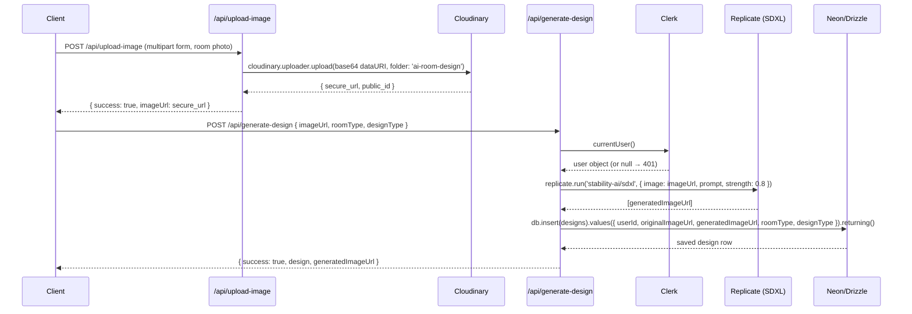

# AI Room Designer

## What this is / why I built it

I built this to learn how to chain multiple AI providers around a real user workflow rather than just calling one model in isolation. The core idea is straightforward: a user uploads a photo of their room, picks a style, and gets back a redesigned version. Under the hood that requires a Cloudinary upload pipeline, a Replicate SDXL image-to-image call that actually preserves room geometry while restyling it, a Drizzle/Neon database write, and a Clerk-gated API layer tying it together.

There is also a second generation path — Ideogram via Replicate — that I added specifically because it solves a different problem: generating a room image from a text prompt alone, with no input photo. The two providers are not redundant; they cover different user intents, and keeping them in the same codebase forced me to think clearly about what each model is actually good for.

The stack is Next.js 15 App Router, React 19, Neon serverless Postgres with Drizzle ORM, Clerk for auth, Cloudinary for image storage, and Replicate as the inference host for both AI models.

---

## Technical highlights

### Dual AI provider setup — what each one actually does

**Replicate SDXL (primary path — `app/api/generate-design`)**

This route accepts an existing room photo URL alongside `roomType` and `designType` parameters. It calls `stability-ai/sdxl` via `replicate.run()` with `image: imageUrl` as input — this is the image-to-image mode. SDXL takes the input image as a structural reference and uses `strength: 0.8` to balance between keeping the room's geometry (walls, windows, furniture footprint) and applying the requested style. The prompt is constructed server-side: `"A professional interior design for a {roomType} in {designStyle} style."` The result is a URL to the generated image, which is then persisted to the `designs` table.

This is the primary path because most users arrive with a real room they want to see redesigned, and image-to-image is the right tool — it doesn't hallucinate a completely different floor plan.

**Ideogram via Replicate (secondary path — `app/api/generate-image`)**

This route accepts only a `prompt`, `style`, and `aspectRatio`. It calls `ideogram-ai/ideogram-v3-turbo` with no input image. There is no `imageUrl` in scope and no DB write to the `designs` table — the generated URL is returned to the client directly. This path is for users who want to explore what a space *could* look like from scratch, rather than redesign an existing room. Because it's purely prompt-driven, it's also used for the separate "Generate Image" dashboard page.

The distinction is not about provider preference — it's about capability: SDXL image-to-image needs a source photo; Ideogram text-to-image does not.

---

### Schema and data relationships

Two tables, both declared in `config/schema.js`:

**`users`** — `id` (serial PK), `name`, `email`, `imageUrl` (all `varchar`, `.notNull()`), `credits` (`integer`, `.default(3)`, nullable — no `.notNull()`).

**`designs`** — `id` (serial PK), `userId` (`varchar(256)`, `.notNull()`), `originalImageUrl`, `generatedImageUrl`, `roomType`, `designType` (all `varchar`, `.notNull()`), `additionalRequirements` (`text`, nullable), `createdAt` (`timestamp`, `.defaultNow()`).

`designs.userId` stores the Clerk user ID as a `varchar`. There is **no database-level foreign key** between `designs.userId` and `users.id`. The join is enforced only in application code — when a design is saved, `user.id` is taken from the Clerk session and written directly. I made this trade-off deliberately: Clerk IDs are the authoritative source of identity, so the application layer is the right place to enforce the join rather than adding a DB-level constraint that would require keeping the two tables in sync with Clerk's webhooks. The downside is that if a user row is deleted without cascading, orphaned design rows will remain.

---

### Clerk auth flow

`middleware.js` protects all routes under `/dashboard(.*)` using Clerk's `clerkMiddleware` and `createRouteMatcher`. Every API route that touches user data calls `currentUser()` from `@clerk/nextjs/server` as its first step and returns a 401 if the result is null.

The `verify-user` route (`app/api/verify-user/route.jsx`) handles the one-time identity sync: on first login it calls `currentUser()`, checks whether the user's email already exists in the `users` table, and inserts a new row if not. Subsequent calls return the existing row. This means the `users` table is a local cache of Clerk identity data (name, email, avatar URL) plus the credits counter — it is not the source of truth for authentication.

---

### Cloudinary's role

Cloudinary handles the upload and storage of the original room photo before any AI generation happens. The `upload-image` route (`app/api/upload-image/route.js`) receives a `multipart/form-data` request, converts the file to a base64 data URI, and calls `cloudinary.uploader.upload()` with `folder: 'ai-room-design'`. It returns a `secure_url` that the client then passes to `generate-design` as the `imageUrl` parameter.

Cloudinary is storage/delivery only — it does not do any image transformation in this project. The generated image URL that comes back from Replicate is stored directly (as a Replicate CDN URL); it is not re-uploaded to Cloudinary.

---

## Architecture diagram

The flow below traces a full design generation request, from room photo to generated result, as implemented in the actual route handlers.



---

## Honest limitations

- **No server-side credits enforcement.** The `credits` field in `users` defaults to `3` and is displayed in the dashboard header (`app/dashboard/_components/Header.jsx`, lines 52–54). Neither `app/api/generate-design/route.js` nor `app/api/generate-image/route.js` reads or decrements `credits` before calling Replicate or Ideogram. An authenticated user with `credits = 0` can POST directly to either endpoint and generation will succeed. This is a known gap, not an oversight that slipped through — documenting it here so the next engineer (or future me) knows exactly where to add the guard.

- **No database-level foreign key between `designs.userId` and `users.id`.** Documented above under Schema. If a `users` row is deleted, the associated `designs` rows will remain with no referential integrity check at the DB layer.

- **Hardcoded database credentials in `drizzle.config.js`.** The Neon connection string, including the password, is committed directly to the repository. The credentials must be rotated and the string must be replaced with `process.env.DATABASE_URL`. The commit history also needs to be scrubbed (e.g., with `git filter-repo`) because a simple delete-and-commit does not remove it from git history.

- **Fixed: `ReferenceError` in `verify-user` route.** `app/api/verify-user/route.jsx` previously caught with parameter `e` but referenced `error` on lines 45–46. Any database failure in that route would throw a secondary `ReferenceError: error is not defined` rather than returning the intended 500 JSON response. Fixed by renaming the catch parameter to `error`.

- **Test suite added in this pass.** There were no tests before this documentation/audit pass. The suite added covers Drizzle schema shape assertions and the `generate-design` and `upload-image` route handlers (happy path, 401, 400, 500) with all external calls mocked. See `__tests__/` for coverage details.

- **`generate-image` route does not write to the database.** Ideogram-generated images are returned to the client but not persisted to the `designs` table. Whether this is intentional or an oversight is unclear from the code alone — flagged as ambiguous.

---

## Setup / running locally

```bash
# 1. Clone and install
git clone <repo-url>
cd AI-ROOM-DESIGNER
npm install

# 2. Environment variables
# Copy .env.example (or create .env.local) and fill in:
NEXT_PUBLIC_CLOUDINARY_CLOUD_NAME=
NEXT_PUBLIC_CLOUDINARY_API_KEY=
CLOUDINARY_API_SECRET=
REPLICATE_API_TOKEN=
NEXT_PUBLIC_CLERK_PUBLISHABLE_KEY=
CLERK_SECRET_KEY=
DATABASE_URL=                       # Neon connection string (server-only; do not prefix with NEXT_PUBLIC_)

# 3. Run dev server
npm run dev
# Open http://localhost:3000

# 4. Run tests (no credentials required — all external calls are mocked)
npm test
```

**Required external accounts:** Neon (free tier sufficient), Cloudinary (free tier), Replicate (pay-per-run), Clerk (free tier).
