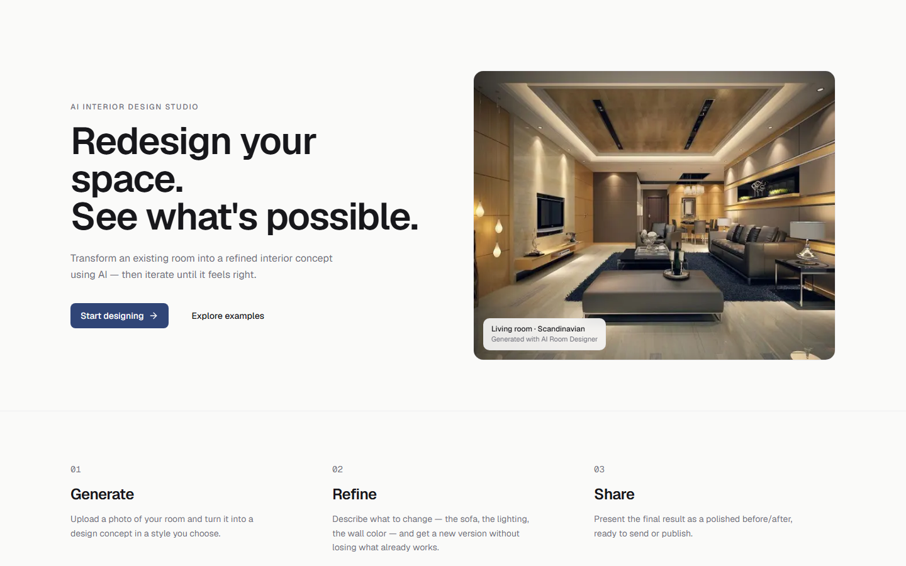
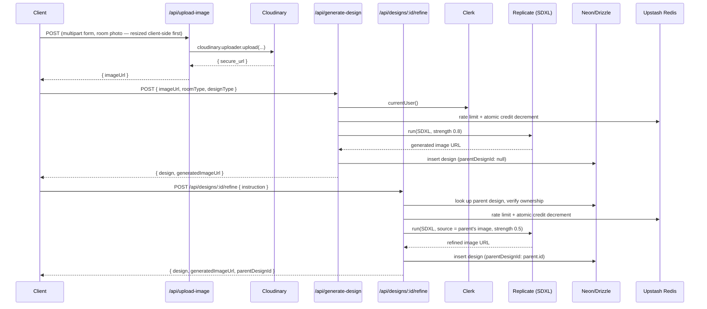

# AI Room Design

## Product demo

Live at **https://ai-room-designer-rho.vercel.app** — deployed on Vercel,
backed by a real Neon Postgres database, real Clerk auth, real Cloudinary
storage, and real Replicate inference (SDXL + Ideogram), not a demo/mock
environment. `docs/deployment.md` and `docs/deployment-checklist.md` cover
how it's deployed.



The landing page above is a real screenshot of the live deployment (captured
with Playwright against production, not a mockup). Screenshots of the
authenticated generation/refinement flow — the actual point of this
project — aren't included yet: that requires a real signed-in session and
a completed AI generation, neither of which has been exercised end-to-end
against production yet. Not fabricating those until they're real.

## What this is

Upload a photo of your room, pick a style, and get back a redesigned version — then keep iterating on it. Say "change the sofa to a beige sectional" or "make the walls warmer" against a design you already have, and get a new version linked back to the one before it, without losing the room you started with. That refinement loop — not the one-shot generation — is the actual point of this project: most AI redesign tools give you a single result and stop; this one treats a design as something you converge on, not something you get right in one try.

There is also a separate text-to-image path (Ideogram via Replicate) for generating a room concept from a written description alone, with no starting photo — a different intent from redesigning a real room, so it stays a separate flow rather than being forced into the same one.

A design is private by default; sharing one explicitly creates a public `/share/:id` page (before/after, no auth required, with social-preview metadata) so a result can actually be sent to someone instead of only being visible inside the dashboard.

The stack is Next.js 15 App Router, React 19, Neon serverless Postgres with Drizzle ORM, Clerk for auth, Cloudinary for image storage, Upstash Redis for credits/rate-limiting, and Replicate as the inference host for both AI models.

---

## Key feature: iterative design refinement

`POST /api/designs/:id/refine` takes a short instruction ("change the sofa") against an existing design and produces a new one, linked to it via a self-referencing `parentDesignId` column on `designs`. A design's history is just an ordered chain — original → v1 → v2 — not a tree editor; the dashboard renders each chain as a simple vertical sequence, comparing each version to the one right before it.

A refinement always regenerates from the **previous generation's image**, not the original photo, so "change the sofa" doesn't also silently undo an earlier "warmer walls" change. The prompt sent to SDXL is built explicitly around three things: the established style, the one requested change, and an explicit list of what to preserve (architecture, walls, windows, doors, camera perspective, existing furniture and colors except what was asked to change).

Initial generation and refinement use different SDXL parameters, on purpose:

| | `strength` | `guidance_scale` | why |
|---|---|---|---|
| Initial generation | 0.8 | 7.5 | needs room to transform a real photo into a styled room |
| Refinement | 0.5 | 8.5 | should change less of an already-styled image; lower strength needs higher guidance so the one requested change still comes through instead of being smoothed away |

**Honest caveat:** SDXL image-to-image has no masking or inpainting — there is no way to say "only touch this region." Lower strength biases the model toward smaller, more targeted changes, but it cannot *guarantee* that only the requested object changes. Product copy says "Refine this design," never "guaranteed to change only one thing." The natural next step, if this turns out to matter in practice, is segmentation/masking so a refinement can be scoped to an actual region instead of the whole frame — worth building once there's evidence of where prompt-only refinement actually fails, not before (see `docs/ai-quality-decision-framework.md`).

---

## AI generation architecture

Route handlers depend on `ImageGenerationProvider` (`lib/generation/types.ts` — `generate()`/`refine()`), not on Replicate or its SDK directly. `ReplicateSdxlProvider` (`lib/generation/providers.ts`) is the only implementation today, wrapping the same `config/replicateConfig.ts` logic that's always been there — this is a seam, not a rewrite. The point: swapping to a self-hosted open-weight model later (FLUX, Stable Diffusion, a custom LoRA) means writing a new class against the same interface, not touching route handlers, credit logic, or the data model. Ideogram (`generate-image`) is deliberately **not** wired through this interface — it's a free-text-prompt, generate-only model with no natural fit to `GenerateInput`'s room/style shape, and forcing it in would lose information rather than abstract anything real.

`GenerationService.runGenerationAttempt()` (`lib/generation/generationService.ts`) wraps every provider call with a `generations` table row: inserted as `pending`/`processing` before the call, updated to `completed` or `failed` after — a provider call that resolves without throwing but returns zero images is still recorded as `failed`, not `completed`, since the table is meant to answer "did this attempt produce something usable," not just "did the HTTP call survive." This still runs synchronously within one request (no queue, no polling) — see `PROJECT_AUDIT.md`'s "why not go async yet" for when that would change.

---

## Architecture



If either Replicate call fails or returns nothing, the route calls `refundCredit()` (an atomic Redis `INCR`) before responding — a failed generation never costs the user a credit. Both routes validate the request body **before** touching credits at all, so a 400/401/402/429 never does either.

### Schema and data relationships

**`users`** — `id` (serial PK), `name`, `email` (`.unique()`), `imageUrl`, `credits` (`.default(3)`), `clerkId` (`.unique()`).

**`designs`** — `id` (serial PK), `userId` (Clerk ID, FK → `users.clerkId`, `ON DELETE CASCADE`), `originalImageUrl`, `generatedImageUrl`, `roomType`, `designType`, `additionalRequirements`, `createdAt`, `parentDesignId` (nullable, self-referencing FK → `designs.id`, `ON DELETE SET NULL`, indexed), `isPublic` (default `false`).

`originalImageUrl` is carried forward unchanged through an entire refinement chain, so a v3 design can still be compared back to the actual starting photo, not just its immediate parent.

**`generations`** — one row per provider *attempt*, not per successful design: `status` (`pending`/`processing`/`completed`/`failed`), `generationType` (`initial`/`refinement`), `provider`, `parentDesignId` and `designId` (both nullable FKs → `designs.id`, `ON DELETE SET NULL`), `errorMessage`, `latencyMs`. No FK on `userId` — like `events`, this is an audit log, not a core relational entity, and must be able to record an attempt even if a brand-new user's `users` row hasn't been provisioned yet.

**`credit_transactions`** — an auditable ledger alongside Redis: `type` (`grant`/`generation`/`refund`/`purchase`/`adjustment`), `amount`, `balanceAfter`, `generationId` (nullable FK → `generations.id`). Redis stays the fast, atomic source of truth for whether a request is allowed to proceed; this table exists so "why does this user have 2 credits" has an actual answer instead of just a current balance.

**`events`** — product analytics; see "Analytics and feedback" below.

### Auth flow

`middleware.js` protects `/dashboard(.*)` via Clerk's `clerkMiddleware`. Every API route that touches user data calls `currentUser()` first and 401s on null. User provisioning is idempotent and race-safe: both the Clerk webhook (`user.created`) and a client-triggered fallback call the same `upsertUserFromClerk()`, which uses `INSERT ... ON CONFLICT DO NOTHING` — whichever caller wins the race gets the inserted row back, the other falls through to a `SELECT` for the same row. Neither path throws.

### Credits and rate limiting

Both generation routes and the refine route share one Redis-backed gate: a sliding-window rate limiter (10 req/min per user via `@upstash/ratelimit`) and an atomic Lua check-and-decrement for credits (`credits:{userId}` in Redis). Postgres `users.credits` is a display-only mirror, updated best-effort after a successful generation — Redis is the source of truth enforcement runs against. Every decrement/refund also writes a `credit_transactions` row (best-effort, never blocks the request) so the balance has an audit trail, not just a current number.

### Public sharing

`designs.isPublic` is `false` by default. `POST /api/designs/:id/share` is the only way to flip it — owner-only, idempotent, same 404-not-403 ownership check as refine. `/share/:id` re-checks `isPublic` on every load rather than trusting the URL, renders a before/after with `generateMetadata`-driven OG/Twitter previews, and offers a "Design your own room" CTA — the deliberate first growth loop (see `docs/growth-experiments.md`). There's currently no way to revoke sharing once granted.

### Analytics and feedback

One Postgres table (`events`: userId, event name, a small JSON properties bag) backs both the product funnel (`docs/analytics-funnel.md`) and two lightweight in-product feedback widgets — an emoji reaction after a first generation, and a checklist after each refinement asking specifically whether it changed what was asked, preserved the room, changed too much, or looked unrealistic. That second one exists to eventually justify (or rule out) a segmentation/masking investment with real data instead of a guess — see `docs/ai-quality-decision-framework.md`.

---

## Honest limitations

- **Refinement can't guarantee single-object edits.** See the caveat above — this is a property of prompt-driven img2img, not a bug to fix quietly. `docs/ai-quality-decision-framework.md` covers how to decide whether that's ever worth fixing with segmentation/masking.
- **Sharing can't be revoked.** Once a design is shared via `POST /api/designs/:id/share`, there's no endpoint to set `isPublic` back to `false`. A real gap, not an oversight to leave silent.
- **No automated component/browser test beyond a small Playwright suite.** `npm run test:e2e` covers create-new, refinement, and sharing against in-memory test doubles (see `e2e/README.md` for exactly what's mocked and why) — it proves the frontend wiring holds together, not that real Replicate/Cloudinary/Clerk calls behave the same way. `docs/manual-qa-checklist.md` is what actually verifies that, against a real deployment.
- **Migration `0003_reconcile_schema_constraints.sql` is generated but not applied.** It reconciles schema.ts (which declares `createdAt`/`credits` NOT NULL and `email` UNIQUE) against the actual migration history, which never added those DB-level constraints. It's additive/constraint-only and idempotent, but adding NOT NULL or UNIQUE constraints can fail against existing rows with nulls or duplicate emails — see `docs/db-migration-checklist.md` before applying it.
- **`generate-image` (Ideogram) results aren't part of any refinement chain.** They're saved to the same `designs` table for gallery visibility, but `roomType` is set to the placeholder `"ai-image"` since there's no real room behind them — this is a different intent (concept generation, not room redesign) and intentionally isn't wired into the versioning feature above.

---

## Setup / running locally

```bash
# 1. Clone and install
git clone <repo-url>
cd AI-ROOM-DESIGNER
npm install

# 2. Environment variables — copy .env.example (or create .env.local):
NEXT_PUBLIC_CLOUDINARY_CLOUD_NAME=
NEXT_PUBLIC_CLOUDINARY_API_KEY=
CLOUDINARY_API_SECRET=
REPLICATE_API_TOKEN=
NEXT_PUBLIC_CLERK_PUBLISHABLE_KEY=
CLERK_SECRET_KEY=
CLERK_WEBHOOK_SECRET=
DATABASE_URL=                       # Neon connection string (server-only; do not prefix with NEXT_PUBLIC_)
UPSTASH_REDIS_REST_URL=
UPSTASH_REDIS_REST_TOKEN=

# 3. Run dev server
npm run dev
# Open http://localhost:3000

# 4. Run tests (no credentials required — all external calls are mocked)
npm test

# 5. Run the E2E suite (also no credentials required — see e2e/README.md
#    for what it mocks and why; builds and boots its own server)
npm run test:e2e

# 6. Production build (requires the env vars above to be set, even if
#    to non-functional placeholder values, since Next prerenders pages
#    that read them at build time). Use a clean checkout / cleared
#    .next — see next.config.mjs's distDir comment for why that matters.
npm run build
```

**Required external accounts:** Neon (free tier), Cloudinary (free tier), Replicate (pay-per-run), Clerk (free tier), Upstash Redis (free tier — 10k requests/day).

---

## Engineering highlights (what's actually implemented)

- Atomic Redis-backed credits (Lua check-and-decrement) with refund-on-failure, and a sliding-window rate limiter, shared across all three generation endpoints plus refine and share.
- Idempotent, race-safe user provisioning across two entry points (Clerk webhook + client fallback).
- A chainable AI refinement pipeline: self-referencing data model, provider parameters deliberately tuned differently for initial generation vs. refinement, and a prompt strategy that explicitly separates the requested change from what must be preserved.
- Client-side image downscaling before upload (canvas-based, falls back to the original file on any failure).
- Structured per-generation logging (`lib/observability.ts`) and product-analytics event tracking (`lib/analytics.ts`) across all three generation paths — provider, latency, success/failure, and the design/parent IDs involved.
- Explicit, revocation-free (a known gap) public sharing with owner-only opt-in and social-preview metadata.
- A provider-agnostic generation layer (`ImageGenerationProvider`) plus a `generations` audit table and a `credit_transactions` ledger — see "AI generation architecture" above.
- 116 Vitest tests (authentication, authorization including cross-user ownership checks, rate limiting, credit exhaustion/refund, DB-write-failure fallbacks, analytics tracking, generation-attempt lifecycle) plus a small Playwright E2E suite covering the create → generate → refine → share flow end to end against in-memory test doubles — see `e2e/README.md`.

---

## More documentation

- `PROJECT_AUDIT.md` — the full repository audit and architecture rationale behind the provider abstraction and data-model changes.
- `docs/product-readiness.md` — an honest PASS/NOT TESTED breakdown per area.
- `docs/interview-guide.md` — technical Q&A grounded in what's actually implemented.
- `docs/deployment.md` / `docs/deployment-checklist.md` — how to deploy, and the checklist to run through first.
- `docs/db-migration-checklist.md`, `docs/analytics-funnel.md`, `docs/ai-quality-decision-framework.md`, `docs/growth-experiments.md`, `docs/beta-user-learning-guide.md`, `docs/manual-qa-checklist.md`, `docs/beta-readiness-checklist.md` — see each for its specific scope.
